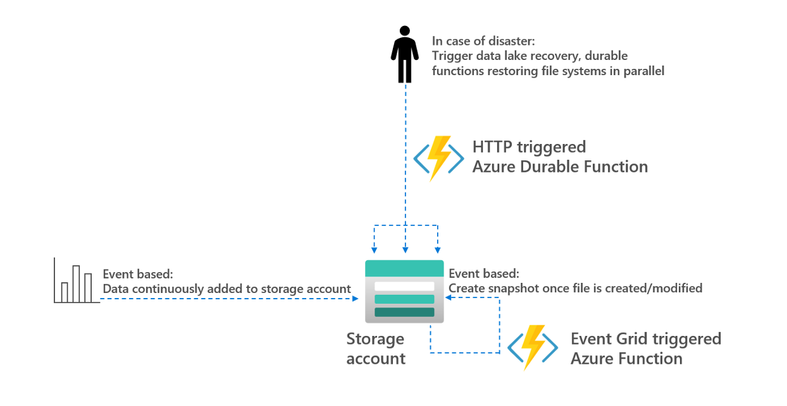

# Restore data lake

See detailed explanation of solution in my blog: https://towardsdatascience.com/how-to-recover-your-azure-data-lake-5b5e53f3736f or run scripts in ```script.ps1```

This repo shows an example how to do point-in-time recovery (pitr) on an Azure Storage account with Hierarchical Namespace Enables (HNS). For that purpose, an Azure Durable Functions is used following the fan-in/fan-out pattern described [here](https://docs.microsoft.com/en-us/azure/azure-functions/durable/durable-functions-cloud-backup?tabs=python). 

## Setup & Demo Flow

This gives a short, high-level overview of how this repo may be used.

